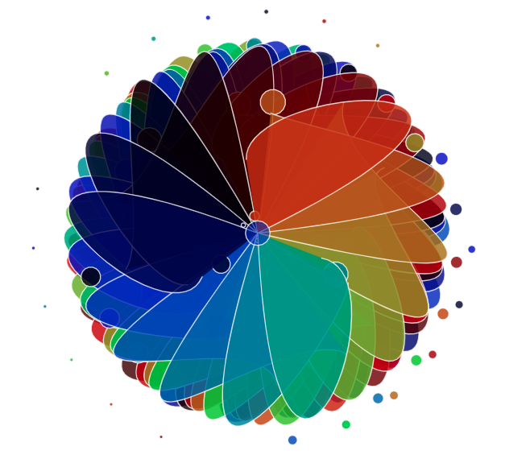
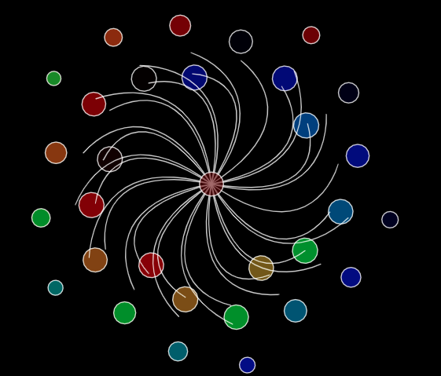
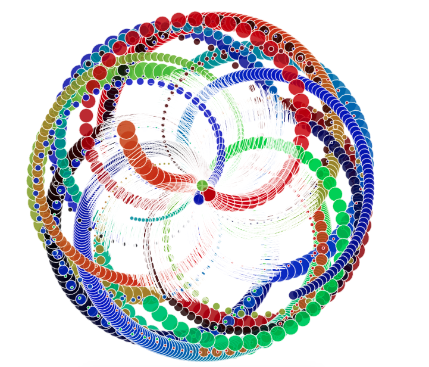

trigo 
=================
Trigonometry-based art.

A live demo can be found [here](https://mahanna.dev/trigo/src/view).

A "workshop" version, allowing you to modify the animation's movement variables, can be found [here](https://mahanna.dev/trigo/src/workshop)

Built with [p5.js](https://p5js.org/).

| | | |
|:-------------------------:|:-------------------------:|:-------------------------:|
| |  ||
