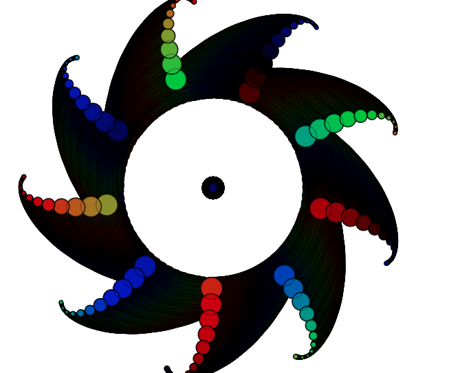

Trigo | p5js 
=================
Processing Animations powered by a rotating a particle system using modified trigonometric functions and RNGs. 

A live demo can be found [here](http://trigo.glitch.me/).

Built with [p5.js](https://p5js.org/).

